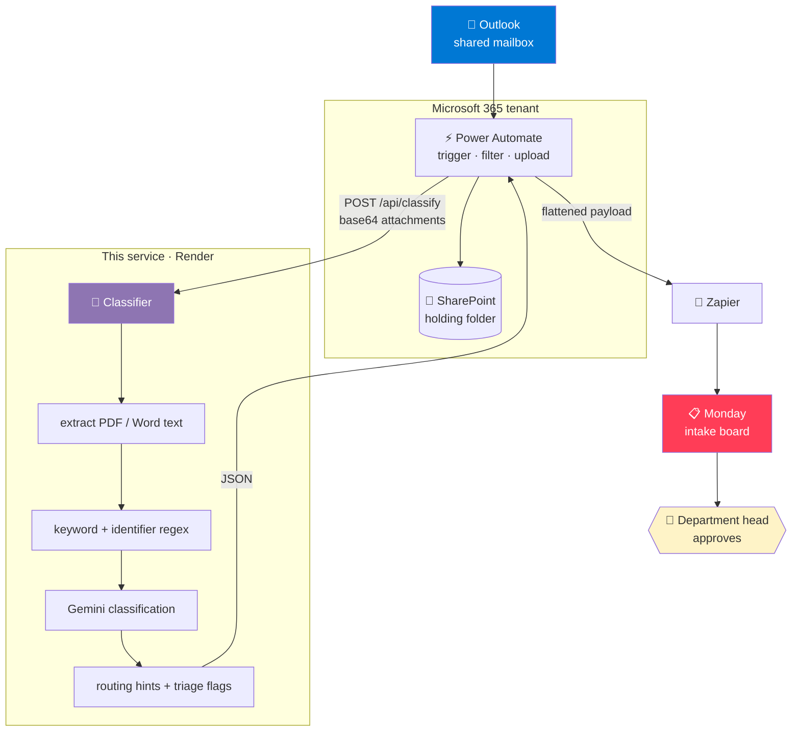

<div align="center">

# 📬 Finishes Email Classifier

**An AI service that reads incoming emails and their attachments, sorts them into governance categories, and tells you which project they belong to.**

Built for the Finishes 3.0 governance system — turning an inbox into governed, traceable records.

<sub>
<a href="#-what-it-does">What it does</a> ·
<a href="#-architecture">Architecture</a> ·
<a href="#-quick-start">Quick start</a> ·
<a href="#-api">API</a> ·
<a href="#-documentation">Docs</a>
</sub>

<br>


</div>

---

## 🎯 What it does

An email arrives at `construction@`. It has three PDFs attached. Somebody has to
decide what it is, which project it belongs to, and where it gets filed — before
anything can be governed.

This service does the reading part.

| It does this | Why it matters |
|---|---|
| **Classifies the email** into one of seven governance categories | with a plain-English rationale for every call — no black box |
| **Reads inside PDF and Word attachments**, including tables | the answer usually isn't in the subject line |
| **Extracts project identifiers** (`OP-142`, `AS-087`) from subject, body, and document text | tells you *which* deal or asset, not just *what kind* of email |
| **Attributes each identifier to the file it came from** | so a reviewer can see which document belongs to which project |
| **Flags multi-project emails** for human review | three projects in one email won't get silently filed against one |
| **Flags low-confidence calls** instead of guessing | the model says "I'm not sure" rather than being confidently wrong |
| **Returns routing hints** — SharePoint folder, Monday board, priority | so the orchestrator doesn't need its own logic |

It does **not** write to SharePoint or Monday. It returns decisions; the
orchestrator takes the actions. That separation is deliberate — see
[INTEGRATION.md](docs/INTEGRATION.md).

### The seven categories

`Development / Construction` · `Payment / Billing` · `Lease / Occupancy` · `Compliance / Legal` · `Capital / Finance` · `Vendor Performance` · `General Governance`

---

## 🏗 Architecture



**The service is Steps 5–6 of a larger flow.** Everything else is orchestration
around it — and that's the point. Zapier, Power Automate, or curl all call the
same endpoint and get the same answer.

Attachments never leave the Microsoft tenant; only the classification metadata
crosses to Zapier for the Monday write. Full rationale, including why Zapier
*cannot* handle the mailbox side, is in [INTEGRATION.md](docs/INTEGRATION.md).

---

## 📤 Example

**Request** — an email with two attachments spanning two projects:

```jsonc
POST /api/classify
Authorization: Bearer <API_TOKEN>

{
  "sender_domain": "gc-buildwell.com",
  "subject": "Executed lease and permit approval — Maple Crossing",
  "body": "Both documents attached for your records.",
  "attachments": [
    { "filename": "Lease_Agreement_OP-142.pdf",  "content_base64": "JVBERi0xLjQK..." },
    { "filename": "Permit_Approval_OP-118.pdf",  "content_base64": "JVBERi0xLjQK..." }
  ]
}
```

**Response:**

```jsonc
{
  "email": {
    "label": "Lease / Occupancy",
    "confidence": 0.9,
    "rationale": "The email transmits an executed commercial lease detailing terms
                  between landlord and tenant, including rent and occupancy.",

    "identifier": "OP-142",
    "identifier_rationale": "OP-142 is the Project Reference in the lease, which the
                             subject names first.",
    "identifier_candidates": ["OP-142", "OP-118"],

    "keyword_hits": ["lease", "tenant", "rent", "permit", "approval"],
    "priority_hint": "High",
    "monday_board_hint": "Asset Management Intake",
    "sharepoint_folder": "/Deals/01_Active_Deals/OP-142",

    "multiple_projects_detected": true,   // ⚠️ two projects in one email
    "needs_review": true,
    "needs_review_text": "Yes",
    "review_reasons": ["multiple_projects_detected"]
  },
  "attachments_analyzed": [
    { "filename": "Lease_Agreement_OP-142.pdf", "size_bytes": 5334, "identifiers_found": ["OP-142"] },
    { "filename": "Permit_Approval_OP-118.pdf", "size_bytes": 5405, "identifiers_found": ["OP-118"] }
  ],
  "model": "gemini-2.5-flash"
}
```

> **The email is the unit of classification.** One email → one label → one intake
> item. Attachments are *evidence* — each is scanned for identifiers so a reviewer
> can see which file references which project, but they're never individually
> labeled.

### Two numbers, two jobs

`confidence` is **self-reported by the model** and uncalibrated — it's debug data
for a human reading the rationale. `needs_review` is the **decision**: downstream
branches on the boolean, never the float. Threshold lives in one constant
(`CONFIDENCE_THRESHOLD`) and is a product choice, not a statistical one.

---

## 🚀 Quick start

```bash
git clone https://github.com/codyveladev/finishes-email-classifier-poc.git
cd finishes-email-classifier-poc

python -m venv .venv
.venv/Scripts/activate          # Windows
# source .venv/bin/activate     # macOS / Linux

pip install -r requirements.txt
cp .env.example .env            # then add your keys
```

`.env` needs two things:

```ini
GEMINI_API_KEY=...    # free tier: https://aistudio.google.com/apikey
API_TOKEN=...         # any long random string; guards /api/*
```

### Try it

```bash
# CLI — classifies the lease sample
python run_cli.py

# Web form — http://127.0.0.1:8000
uvicorn app:app --reload

# API
curl -X POST http://127.0.0.1:8000/api/classify \
  -H "Authorization: Bearer $API_TOKEN" \
  -H "Content-Type: application/json" \
  -d '{"sender_domain":"apex-glass.com","subject":"Invoice #4471 due Net 30","body":"","attachments":[]}'
```

The web form has preset test cases, file upload, and a live model badge — it's
the fastest way to see the classifier work.

---

## 🔌 API

| Endpoint | Body | Built for |
|---|---|---|
| `POST /api/classify` | JSON, attachments base64-encoded | Power Automate, curl, anything that builds JSON |
| `POST /api/classify-upload` | `multipart/form-data`, real file parts | clients that send files natively |
| `GET /` · `POST /classify` | HTML form | demos and manual QA |
| `GET /docs` | — | OpenAPI, with an Authorize button |

**Auth:** `Authorization: Bearer <API_TOKEN>` on `/api/*`. Fails closed — if
`API_TOKEN` isn't set on the server, the endpoint returns 500 rather than
running unguarded.

**Limits:** 10 attachments per email, 10 MB per file (`MAX_ATTACHMENTS`,
`MAX_ATTACHMENT_BYTES`). Zero attachments is valid — it classifies on subject
and body alone.

**Errors** are `{ "error": "...", "code": "..." }` with a meaningful status:

| Code | Status | |
|---|---|---|
| `unauthorized` | 401 | bad or missing token |
| `invalid_base64` | 400 | includes a preview of what arrived |
| `too_many_attachments` | 400 | over the cap |
| `attachment_too_large` | 413 | over the size limit |
| `rate_limited` | 429 | Gemini free tier is 5 req/min |
| `upstream_unavailable` | 503 | Gemini having a moment |

---

## 🗂 Project structure

```
├── classifier.py       🧠 the core — keyword pass, identifier regex, Gemini call
├── service.py             transport-agnostic pipeline shared by both API routes
├── extract.py             attachment text — PDF (pdfplumber → pypdf), Word (paragraphs + tables)
├── categories.py          the 7 labels and their keyword cues
├── routing.py             label + identifier → SharePoint path, Monday hints, priority
├── schemas.py             pydantic request/response contracts
├── cases.py               shared test cases — feeds both the suite and the web form presets
│
├── app.py                 FastAPI entry point (23 lines — it just wires things)
├── routers/
│   ├── api.py             JSON + multipart endpoints
│   └── web.py             HTML form, PRG cache
├── config.py              settings from env
├── dependencies.py        bearer auth
├── errors.py              structured errors, Gemini exception translation
│
├── run_cli.py             CLI demo
├── test_cases.py          classification accuracy suite
├── test_api.py            47 API assertions
└── samples/               lease, vendor agreement, change order
```

---

## 🧪 Testing

```bash
# API suite — 47 assertions: auth, validation, encodings,
# multi-project detection, both transports
SKIP_LIVE=1 python test_api.py     # stubs the LLM, zero API calls
python test_api.py                 # adds one live Gemini call

# Classification accuracy — one case by default (free tier is 5 req/min)
python test_cases.py
RUN_ALL=1 python test_cases.py     # all 7 categories, 13s apart
```

The multi-project test uses **two real sample PDFs** with only the LLM stubbed,
so the extraction, regex, and per-file attribution are genuinely exercised.

---

## 📚 Documentation

| | |
|---|---|
| **[INTEGRATION.md](docs/INTEGRATION.md)** | How the live system is wired end to end — every Power Automate expression, the Zapier setup, and the binary-encoding traps that cost real hours. **Read this before touching the flow.** |
| **[PLAN.md](docs/PLAN.md)** | The build plan and per-phase design decisions |
| **[PROGRESS.md](docs/PROGRESS.md)** | Build log |
| **[API_TEST_CASES.md](docs/API_TEST_CASES.md)** | 12 copy-paste test cases with expected results, plus the Parse JSON schema |

---

## ✅ Status

**Running end to end against a real mailbox.** An email with three PDFs
(`OP-118`, `OP-142`, `AS-087`) files all three to SharePoint, extracts text from
inside each, unions the identifiers, trips `multiple_projects_detected`, and
lands a flagged item on the Monday intake board.

<table>
<tr><td>

**Shipped**
- Core classifier + 7 categories
- PDF and Word extraction
- Identifier extraction with per-file attribution
- Multi-project detection
- JSON + multipart API, bearer auth
- Multi-attachment (cap 10)
- Web form with presets
- Live Power Automate → Zapier → Monday pipeline

</td><td>

**Not yet**
- Idempotency (retries → duplicate items)
- Filename identifier scanning
- Excel (`.xlsx`) extraction
- Move-to-final-folder on approval
- Azure hosting + Azure OpenAI
- Confidence calibration

</td></tr>
</table>

Detail on each gap: [INTEGRATION.md §7](docs/INTEGRATION.md).

---

<div align="center">
<sub>Proof of concept · Finishes 3.0 Governance System · Ref: Exhibit A</sub>
</div>
